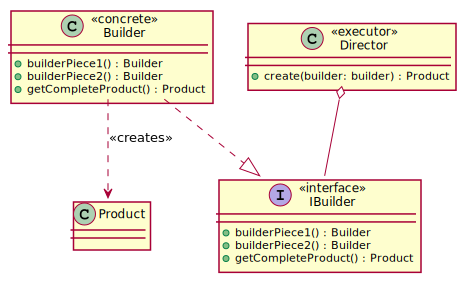

# Builder

Builder pattern is all about providing flexibility in Object Creation. The intent of the builder 
design pattern is to isolate the construction of a complex object from its representation.

``

