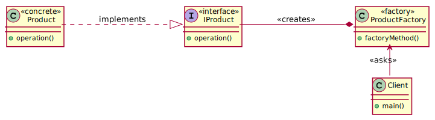

# Factory

The factory design pattern is a way to instantiating a class inside a designated method that we 
call a **factory method**.

> **Factory** is an object that is able to create other objects.

