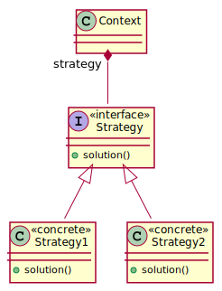

# Strategy

The strategy design pattern is use when we have multiple solution or algorithms to solve a 
specific task and client decides the specific implementation which is to be used at runtime.

